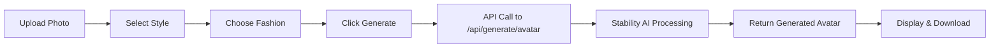

# Avatar G - API Integration Setup Guide

## ✅ What's Been Completed

### Code Updates:
1. ✅ Created `.env.local` file template
2. ✅ Built Avatar Generation API (`/api/generate/avatar`)
3. ✅ Updated Avatar Builder to use real AI generation
4. ✅ Integrated Stability AI for image generation
5. ✅ Added error handling and progress tracking

---

## 🔑 Required API Keys & Services

### 1. Supabase (REQUIRED - Database & Authentication)
**Core backend service for user data and authentication**

**Get your credentials:**
1. Go to https://supabase.com/
2. Create a new project or use existing
3. Go to Project Settings → API
4. Copy the Project URL and anon/public key

**Add to `.env.local`:**
```bash
NEXT_PUBLIC_SUPABASE_URL=https://your-project.supabase.co
NEXT_PUBLIC_SUPABASE_ANON_KEY=your-anon-key-here
```

**Status:** ✅ Already configured in production

---

### 2. Cloudflare R2 (REQUIRED - File Storage)
**Used for storing avatars, images, and generated content**

**Get your credentials:**
1. Go to https://dash.cloudflare.com/
2. Navigate to R2 Object Storage
3. Create a bucket or use existing
4. Generate API tokens from Account → R2 → API Tokens

**Add to `.env.local`:**
```bash
R2_ACCOUNT_ID=your-account-id
R2_ACCESS_KEY_ID=your-access-key-id
R2_SECRET_ACCESS_KEY=your-secret-access-key
R2_BUCKET_NAME=your-bucket-name
R2_ENDPOINT=https://your-account-id.r2.cloudflarestorage.com
R2_REGION=auto
```

**Status:** ✅ Already configured in production

---

### 3. API URLs (REQUIRED - Service Endpoints)
**Configure API endpoints for frontend communication**

**Add to `.env.local`:**
```bash
NEXT_PUBLIC_API_URL=https://your-api-domain.com
NEXT_PUBLIC_PENTAGON_API_URL=https://your-pentagon-api.com
```

**Status:** ✅ Already configured in production

---

### 4. Stability AI (REQUIRED - For Avatar & Image Generation)
**You need this for the avatar builder to work!**

**Get your API key:**
1. Go to https://platform.stability.ai/
2. Sign up / Login
3. Go to "Account" → "API Keys"
4. Create a new API key
5. Copy the key (starts with `sk-...`)

**Add to `.env.local`:**
```bash
STABILITY_API_KEY=sk-your-stability-api-key-here
```

**Pricing:** ~$10 for 1,000 images (512x512) or ~$30 for 1,000 images (1024x1024)

---

### 2. Runway ML (REQUIRED - For Video Generation)
**You already have $10 paid subscription!**

**Get your API key:**
1. Go to https://runwayml.com/
2. Login to your account
3. Go to Settings → API Access
4. Generate an API key
5. Copy the key

**Add to `.env.local`:**
```bash
RUNWAY_API_KEY=your-runway-api-key-here
```

**Your plan:** $10/month basic package ✅

---

### 3. OpenAI (OPTIONAL - For enhanced features)
**Not required for avatar builder, but useful for chat/text features**

**Get your API key:**
1. Go to https://platform.openai.com/
2. Login / Sign up
3. Go to API Keys section
4. Create new secret key
5. Copy it (starts with `sk-...`)

**Add to `.env.local`:**
```bash
OPENAI_API_KEY=sk-your-openai-key-here
```

**Free tier:** $5 credits for new users

---

### 4. Replicate (OPTIONAL - Alternative to Stability AI)
**Backup option if Stability AI fails**

**Get your API key:**
1. Go to https://replicate.com/
2. Sign up / Login
3. Go to Account Settings
4. Copy API token

**Add to `.env.local`:**
```bash
REPLICATE_API_TOKEN=your-replicate-token-here
```

**Pricing:** Pay per use, typically $0.001-0.05 per generation

---

## 📋 Complete Setup Steps

### Step 1: Add API Keys to `.env.local`

Open the file at:
```
avatar-g-frontend-v3/.env.local
```

Fill in your API keys:
```bash
# CORE SERVICES (REQUIRED)
NEXT_PUBLIC_SUPABASE_URL=https://your-project.supabase.co
NEXT_PUBLIC_SUPABASE_ANON_KEY=your-anon-key-here

# CLOUDFLARE R2 STORAGE (REQUIRED)
R2_ACCOUNT_ID=your-account-id
R2_ACCESS_KEY_ID=your-access-key-id
R2_SECRET_ACCESS_KEY=your-secret-access-key
R2_BUCKET_NAME=your-bucket-name
R2_ENDPOINT=https://your-account-id.r2.cloudflarestorage.com
R2_REGION=auto

# API ENDPOINTS (REQUIRED)
NEXT_PUBLIC_API_URL=https://your-api-domain.com
NEXT_PUBLIC_PENTAGON_API_URL=https://your-pentagon-api.com

# AI SERVICES (REQUIRED FOR AVATAR BUILDER)
STABILITY_API_KEY=sk-your-actual-key-here

# AI SERVICES (REQUIRED FOR VIDEO GENERATION)
RUNWAY_API_KEY=your-runway-key-here

# OPTIONAL AI SERVICES
OPENAI_API_KEY=sk-your-openai-key-here
REPLICATE_API_TOKEN=r8_your-replicate-token-here
```

### Step 2: Restart the Development Server

```bash
# Stop current server (Ctrl+C in terminal)
npm run dev
```

The server will reload with your new environment variables.

### Step 3: Test Avatar Builder

1. Go to http://localhost:3002/services/avatar-builder
2. Upload a photo
3. Click "Generate Avatar"
4. Customize style and fashion
5. Preview and download

---

## 🚀 Deploy to Vercel

###NEXT_PUBLIC_SUPABASE_URL` | `https://your-project.supabase.co` | All Environments |
| `NEXT_PUBLIC_SUPABASE_ANON_KEY` | `your-anon-key` | All Environments |
| `R2_ACCOUNT_ID` | `your-account-id` | All Environments |
| `R2_ACCESS_KEY_ID` | `your-access-key-id` | All Environments |
| `R2_SECRET_ACCESS_KEY` | `your-secret-key` | All Environments |
| `R2_BUCKET_NAME` | `your-bucket-name` | All Environments |
| `R2_ENDPOINT` | `https://...r2.cloudflarestorage.com` | All Environments |
| `R2_REGION` | `auto` | All Environments |
| `NEXT_PUBLIC_API_URL` | `https://your-api-domain.com` | All Environments |
| `NEXT_PUBLIC_PENTAGON_API_URL` | `https://your-pentagon-api.com` | All Environments |
| `STABILITY_API_KEY` | `sk-your-key` | All Environments |
| `RUNWAY_API_KEY` | `your-runway-key` | All Environments |
| `OPENAI_API_KEY` | `sk-your-key` | All Environments (Optional) |
| `REPLICATE_API_TOKEN` | `r8_your-token` | All Environments (Optional) |

5. Click **Save**
6. Redeploy your project

**Note:** ✅ Most of these are already configured in your production environment (Updated Feb 2-3, 2026)
### Step 2: Add Environment Variables in Vercel

1. Go to https://vercel.com/dashboard
2. Select your project
3. Go to **Settings** → **Environment Variables**
4. Add each variable:

| Name | Value | Environment |
|------|-------|-------------|
| `STABILITY_API_KEY` | `sk-your-key` | Production, Preview, Development |
| `RUNWAY_API_KEY` | `your-runway-key` | Production, Preview, Development |
| `OPENAI_API_KEY` | `sk-your-key` | Production, Preview, Development |
| `REPLICATE_API_TOKEN` | `r8_your-token` | Production, Preview, Development |

5. Click **Save**
6. Redeploy your project

### Step 3: Verify Deployment

Visit your Vercel URL:
```
https://your-project.vercel.app/services/avatar-builder
```

Test the avatar generation!

---

## 🎨 How Avatar Generation Works



**Processing Flow:**
1. User uploads photo and customizes style
2. Frontend sends request to `/api/generate/avatar`
3. Backend builds AI prompt from style preferences
4. Calls Stability AI API with prompt
5. Receives generated 1024x1024 image
6. Returns to frontend as base64
7. User can download or share

---

## 💰 Cost Estimates

### Avatar Builder (Images)
- **Stability AI:** ~$0.03 per 1024x1024 image
- **Example:** 100 avatars = $3

### Video Generator
- **Runway ML:** Included in your $10/month plan
- **Limits:** Check your Runway dashboard for generation limits

### Music/Image Services
- Depends on which APIs you choose to integrate

---

## 🔧 Troubleshooting

### Error: "Stability AI error"
**Solution:** Check your `STABILITY_API_KEY` in `.env.local`
```bash
# Verify it starts with sk-
STABILITY_API_KEY=sk-...
```

### Error: "Failed to generate avatar"
**Solutions:**
1. Ensure API key is valid
2. Check Stability AI account has credits
3. Check browser console for detailed errors

### Server won't restart
**Solution:**
```bash
# Kill all node processes
taskkill /F /IM node.exe
# Restart server
npm run dev
```

### API key not loading
**Solutions:**
1. Ensure `.env.local` is in project root
2. Restart dev server completely
3. Clear Next.js cache:
```bash
rm -rf .next
npm run dev
```

---

## 📊 API Usage Monitoring

### Stability AI
- Dashboard: https://platform.stability.ai/account/usage
- Monitor: Credits used, API calls, costs

### Production (Vercel)
- [x] Supabase credentials configured
- [x] R2 storage credentials configured  
- [x] API URLs configured
- [x] R2 environment variables added (Feb 2-3, 2026)
- [ ] Stability AI key added
- [ ] Runway ML key added

### Local Development
- [ ] `.env.local` file created with all API keys
- [ ] Supabase credentials added locally
- [ ] R2 credentials added locally
- [ ] Stability AI key added
- [ ] Runway ML key added  
- [ ] Dev server restarted
- [ ] Avatar builder tested locally
- [ ] File uploads to R2 tested

### Deployment
- [ ] Code pushed to GitHub
- [ ] All environment variables added to Vercel
- [ ] Production deployment tested
- [ ] Avatar generation tested in production
- [ ] File storage (R2) tested in production
---

## ✅ Verification Checklist

- [ ] `.env.local` file created with API keys
- [ ] Stability AI key added
- [ ] Runway ML key added  
- [ ] Dev server restarted
- [ ] Avatar builder tested locally
- [ ] Code pushed to GitHub
- [ ] Environment variables added to Vercel
- [ ] Production deployment tested

---

## 🎯 Next Steps

1. **Get API Keys** - Sign up for Stability AI and Runway ML
2. **Add to `.env.local`** - Copy keys into environment file
3. **Test Locally** - Generate an avatar to verify everything works
4. **Deploy to Vercel** - Add environment variables and deploy

---

## 📞 Support

If you encounter issues:
1. Check the browser console for errors
2. Verify API keys are correct
3. Check API provider dashboards for usage/errors
4. Ensure you have sufficient credits/quota

**API Documentation:**
- Stability AI: https://platform.stability.ai/docs
- Runway ML: https://docs.runwayml.com/
- OpenAI: https://platform.openai.com/docs

---

**Last Updated:** February 9, 2026
**Status:** Ready for API key integration
