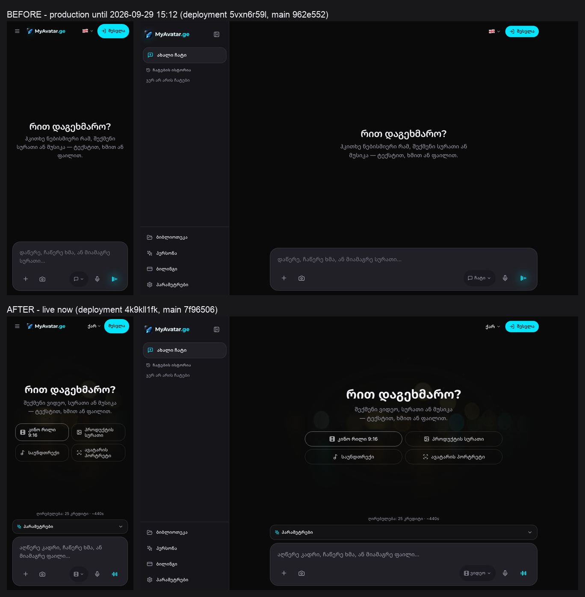

# MyAvatar.ge — DESIGN.md

Written before any pixel or any Higgsfield request. The landing page, the dashboard polish and the brand/v1 image pack all follow this file. If a change breaks a rule here, change this file first.

## 1. What the product is

**A Tbilisi video production studio for Reels, entered through the chat.** You describe a shot in Georgian and get a finished vertical video: footage, Georgian voice, music, subtitles and edit. Image, music, voice and avatar are part of the same studio, always one click away. **Since 2026-10-01 the chat is the hub and the home page (§13); video leads the generators.**

A guest must understand "video studio" within three seconds of landing. The picture says it, the headline says it, and the first card says it.

## 2. Look

**Dark studio, one accent, cinematic stills.** It should feel like a colour-graded night shoot in Old Tbilisi, not an AI dashboard.

| Token | Value | Use |
|---|---|---|
| ink | `#0A0A0A` (`--app-bg`) | page background |
| surface | `#16161A` / `#202026` (`--app-surface` / `--app-elevated`) | panels, the composer, cards |
| hairline | white 8–12 % | borders; never a coloured border |
| text | `#F0F0F5` (`--app-text`) | headings and body |
| muted | `#A0A0AF` (`--app-muted`) | secondary text: 7.7:1 on ink, 7.0:1 on surface. Never below AA (4.5:1) |
| **accent** | **`#00E5FF`** (`--app-accent`) | **the only accent**: the primary CTA, focus rings, `.ge`, active states, small badges |

**One accent only.** The brand sheet's lime (`#C5FF00`) and gold (`#D4AF37`) are brand-sheet colours, not UI colours. The product UI uses cyan and neutrals only. If a second colour seems necessary, the hierarchy is wrong. (`--app-gold` still exists as a token for older surfaces. New UI does not use it.)

The primary CTA is a solid cyan pill with ink text, used once per view. Secondary actions are outline or text.

**The chat's user bubble is the one accent-tinted surface** (`app-accent/10`, no border) — approved by the owner's Gemini-parity brief of 2026-09-30 (§12). Everywhere else the accent stays on controls, states and small badges, and coloured borders stay banned.

## 3. Type

- Georgian text keeps **Noto Sans Georgian**, the current Georgian-capable face. Headlines are weight 700, body text 400/500.
- Latin display uses **Montserrat**, from the brand sheet. Latin body text uses Inter at small sizes only; Inter is not the only face on the page.
- Headline scale: 40 px on phones up to 72 px on desktop, tracking −1 %, line-height 1.1. Georgian has tall ascenders, so a headline line-height is never below 1.1.
- Body text is 16–18 px, line-height 1.6, with a measure of 60–70 characters.
- Numbers use `tabular-nums` wherever they change: prices and counters.

## 4. Imagery — the brand/v1 world

**One world, one grade.** It is Tbilisi at night after rain:
- wet cobblestones and carved Old-Town balconies;
- warm sodium streetlight against cool cyan practicals;
- mist, a 35 mm anamorphic look and fine grain;
- deep blacks with teal-and-amber separation.

Every still is the same world with the same grade and the same seed family. Shot 1 is the reference for the rest.

- **No text, logos, UI or watermarks inside an image.** Type is set in code over the picture.
- A phone screen shows **footage**, never interface.
- Images carry depth. The UI stays flat: hairlines and shadowless panels.
- Generated only from `scripts/hf-art-pack.md`, all costs logged in `public/brand/v1/manifest.json`. The hard cap is $7 and generation stops at $6.50.
- **brand/v1.1 — reels.** Three 5-second vertical loops (R1 street, R2 product, R3 portrait), made by image-to-video from the brand/v1 masters, with no new stills, silent, and the last frame = the first. They are the landing's first proof that this is a video studio. They play only while on screen, never under reduced motion, and sit on their posters until then. Spend: $0.693, first attempt each; the manifest total is $1.437 of the $6.50 stop line.

## 5. Motion and density

- **Motion: low.** Fades and 8–12 px rises of 200–300 ms on `cubic-bezier(.2,.7,.2,1)`. No bounce, no spring overshoot, no parallax.
- `prefers-reduced-motion` disables every movement, including the hero loop, which then shows its poster.
- **Density: medium.** Section rhythm is 96–128 px on desktop and 64–80 px on phones, with an 8 px grid.
- Touch targets are ≥ 44 px, and safe-area insets are respected on every fixed edge.

## 6. Banned

- purple, violet or mesh gradients: the "AI purple" look;
- **glow soup**: neon box-shadows, blurred colour halos, pulsing glows. At most one soft shadow per elevated surface;
- emoji as UI: icons, labels and bullets made of emoji;
- cards inside cards, and borders inside borders;
- bounce and spring easing;
- text baked into generated images;
- a second accent colour, including lime and gold, in product UI;
- stock-looking "AI posters": eight shots in eight styles.

**One exception, the Live screen (§12, the owner's brief of 2026-09-30).** It may carry exactly ONE audio-reactive cyan halo behind its orb — one hue (the accent and its darker cyan shades, never a second colour), still under `prefers-reduced-motion`. No other glows, there or anywhere.

## 7. Copy — locked

**Dashboard empty state.**

| | ka | en | ru |
|---|---|---|---|
| H1 | რით დაგეხმარო? | How can I help? | Чем помочь? |
| Sub | შექმენი ვიდეო, სურათი ან მუსიკა — ტექსტით, ხმით ან ფაილით. | Make a video, an image or music — by text, voice or file. | Создайте видео, изображение или музыку — текстом, голосом или файлом. |
| Placeholder (video) | აღწერე კადრი, ჩაწერე ხმა, ან მიამაგრე ფაილი… | Describe a shot, record your voice, or attach a file… | Опишите кадр, запишите голос или прикрепите файл… |

Only the ka column is locked by the brief; en and ru keep the product's existing greeting and translate the rest. In en and ru, video is always named first. Russian uses «вы» on every surface, the landing included.

**Chat additions (2026-09-30, §12).** Above the locked H1, a signed-in user in the chat sees one personal line — „გამარჯობა, {სახელი}“ / "Hi, {name}" / «Здравствуйте, {name}» — in a cyan-to-text gradient (one hue). The locked H1 and sub line do not change. The chat's placeholder is „ჰკითხე MyAvatar-ს“ / "Ask MyAvatar" / «Спросите MyAvatar», and its disclaimer „MyAvatar ხელოვნური ინტელექტია და შეიძლება შეცდეს.“ / "MyAvatar is AI and can make mistakes." / «MyAvatar — это ИИ, и он может ошибаться.»

**Landing, above the fold.** The ka copy leads; en and ru translate it.
- The H1 says video: **„ვიდეო ერთი იდეიდან.“**
- One sentence follows, naming Reels and the Georgian language.
- The primary CTA is **„შექმენი ვიდეო“** and goes to `/{lang}/dashboard`, signed in or not. The secondary is **„შესვლა“**.

**The three proof steps:** დაწერე → დაარენდერე → გამოაქვეყნე.

**Landing order:**
1. hero;
2. **reels** („ერთი კადრი — და ის მოძრაობს.“: three photos, three five-second shots);
3. the four services, video first;
4. the three steps;
5. the price teaser;
6. closing.

The price teaser states only what is true for every visitor: the price is on the button before you confirm. It makes no claim about the currency (the product shows USD) and no refund promise.

## 8. Components

- **Service cards (4):** image, name and one line. Video comes first and carries a **„მთავარი“** badge. There is no nested panel inside a card and no hover glow; hover lifts the image contrast only.
- **Chips (dashboard):** four hairline pills, video first — კინო რილი 9:16 · პროდუქტის სურათი · საუნდთრექი · ავატარის პორტრეტი — in two rows of two at every width. Hover and press **invert** a chip to a white fill with ink text. A chip selects the service (the reel also sets 9:16) and writes a **starter** into an empty box — a frame the user completes („კინო რილი 9:16 — სცენა: “), never over their own words. An untouched starter cannot be sent (neither the button nor Enter): a chip never sends and never spends.
- **The studio (2026-09-29, the owner's references).** A desktop (`lg`, ≥ 1024 px) opens as **Google AI Studio**: three columns — the navigation on the left, the session in the centre (its own title bar: the session's name · „შესვლა“ for a guest · ✎ new session · the settings toggle), and **„პარამეტრები“** on the right, open by default and closed only on request. A phone is **Gemini**: header ☰ · the name · ✎ · you; the settings are a sheet. A tablet (768–1023) keeps the sidebar and the phone's header and sheet. One settings body renders in exactly one place — the panel or the sheet — and stays mounted while hidden, so a panel's in-flight state (an upload, a dub, a motion job) survives closing it. **Except the chat (§12): pure chat has no settings column, no settings sheet and no settings toggle** — the surface is hidden (still mounted), and leaving the chat brings the panel back as the user left it.
- **Navigation (sidebar and phone drawer, one component):** the name as text · ✎ ახალი სესია · ძებნა · ბიბლიოთეკა · პერსონა · „სერვისები“ (the six tools, the active one marked; „მეტი“ opens the rest) · „ბოლო“ (the history) · at the foot the balance with „შევსება“ (or „შესვლა“ for a guest), settings, language and install. Collapsed on a desktop it is a rail of icons, never nothing. The tool list is `lib/studio/tools.ts` — one list for the sidebar, the „+“ sheet and the settings' service card.
- **Tools:** video · image · music · avatar · remix · chat, and one level down: product ad · character swap · motion · montage · dubbing · 3D model · presentation. A tool is derived from what the studio already holds (mode, video tab, avatar tab, studio panel, editor); `omni:set-tool` selects one, `omni:tool-changed` and `<html data-tool>` announce it, `/dashboard?tool=<id>` opens on it.
- **Composer:** ONE block at the bottom, safe-area aware — nothing stacked above it. (The chat's variant is in §12: no tool chip, the disclaimer instead of the price.) Left: **+** (a sheet: photos · camera · files, then the tools — each tile routed to where the ACTIVE tool reads it) and the **tool chip** — what you make and its shape, „ვიდეო · 9:16 · 24წმ“ — which opens the settings. Right: mic, then the live-voice waveform, which **Run** replaces once there is something to run. ONE Run for every tool: product ad, swap and remix run from the composer too (they used to be reachable only through a button at the foot of their panel); motion opens its settings. The **price** („25 კრედიტი · ~5 წთ“) sits once, under the composer. Textarea 16 px.
- **Settings:** the service card (icon · name · one line · „შეცვლა“), then the essentials — a video's format (9:16 · 1:1 · 16:9 · 4:5) and length (8 · 24 · 48 s, the pipeline's real lengths) as radio groups — then the tool's panel with its long tail folded („სცენარი, აუდიო და ხმები“ opens by itself when it matters). No Generate buttons inside: the composer runs. Section labels are words, not emoji.
- **ResultCard:** one tile for a generation from queued to ready — `components/studio/ui/ResultCard.tsx`. It has the result's shape from the first second (a 9:16 video is a 9:16 tile), a shimmer plate instead of a spinner, a 3 px accent bar and one caption („ვიდეო · 9:16 · 12%“), a 44 px cancel that stops THAT job, and a polite live region that announces state changes (not percent ticks). Progress is the pipeline's real percent when it reports one, otherwise elapsed ÷ cap held at 92 % until the media is here. Ready: the real image or video, with open · download · use as reference. Error: one line, retry, dismiss. The film crew console stays one tap away under the tile („დეტალები“).
- **One mark: the name.** The wordmark, set as text, is the brand everywhere in the chrome — the landing's header and footer, the studio, the hub. The rocket is the app icon, the favicon and the social card, where it stands alone; beside the name it read as a second logo (and its PNG has no alpha, so it is an opaque tile). A reply carries no avatar badge — the „M“ circle looked exactly like the account initial.
- **Header:** the name, language and „შესვლა“ on the landing; on the studio see above. On the landing, „შესვლა“ opens sign-in, and a signed-in visitor goes straight to the studio.

## 9. Routes (invariants)

- `/{lang}/dashboard`, `/chat`, `/agent`, `/pricing` and `/services/*` are untouched.
- Auth, the credit ledger and the generation contracts are untouched.
- `/{lang}` is **the studio, opening on the chat**, for guests (anyone without a session cookie, crawlers included), with the site's home metadata. `/` redirects to the visitor's `/{lang}`. A signed-in visitor keeps going straight to `/{lang}/dashboard` — the same studio with their session (`lib/routing/landing.ts`, §13).
- `/{lang}/landing` is the marketing landing (server-rendered, self-canonical). Its language switch stays on `/{lang}/landing`.
- The sitemap lists `/ka`, `/en`, `/ru` and their `/landing` pages, and never the bare `/`, which only redirects.
- The PWA `start_url` stays `/ka/dashboard`.

## 10. Audit — the burger, the service menu, the rest (2026-09-29)

What the guest dashboard offered before this pass, what it offers now, and what is left.

**The burger (☰, phones; the sidebar on desktop).** It holds: new chat, chat history, then Library, Persona, Billing and Settings, plus „სტუდია β“ on deployments with `STUDIO_V2`. It has **no service list**, and it keeps none: an earlier pass removed the sidebar's duplicate list, so the composer's menu is the only service picker. „Video first in the burger“ is therefore satisfied where the services actually are, in the next item.

> **Superseded the same day** by the owner's Gemini / Google AI Studio references (§8): the sidebar now carries „სერვისები“ again — but not as a duplicate. It, the composer's „+“ sheet and the settings' service card all read ONE list (`lib/studio/tools.ts`), and the composer's „ვიდეო ⌄“ menu below is gone (the chip opens the settings; „+“ picks the tool). The table below is the history of that pass.

**The service menu (the composer's „ვიდეო ⌄“).**

| | Before | After |
|---|---|---|
| Order | ჩატი · სურათი · მუსიკა · ვიდეო · ავატარი · რემიქსი | **ვიდეო** · სურათი · მუსიკა · ავატარი · რემიქსი · ჩატი |
| Default on a fresh visit | ჩატი | **ვიდეო** (9:16) |
| Avatar icon | a speaker | a face, the same as its chip and the landing card |
| Empty state | the greeting over a blank page | the greeting, the locked line, four chips, and the A3 plate at 8 % |
| Options panel, desktop | always open, covering the greeting | on demand at every width, behind „პარამეტრები“; ratio and length are also pills in the composer |

The full studios, Montage, Dubbing, 3D and Presentation, stay below a divider in the same menu, with line icons.

**Header.** The language trigger shows a text label (ქარ / ENG / РУС) instead of an emoji flag. On phones, the sign-in icon is dropped so the wordmark, the language and „შესვლა“ fit at 360 px. The rocket lost its three stacked drop-shadows.

**Composer.** The mic and Send lost their hover-scale. The live-voice button lost its halo. Its equaliser bars are still at rest and move only on hover or focus. With text in the box, Send replaces the live-voice button in the same slot.

**Glow and colour.** Removed on these surfaces: rocket shadows, the live-voice halo, the orange „swap“ tab (now the accent), and the ★ label. Kept on purpose: `text-emerald-400` on the „generation complete“ check. A success state is status, not a second accent.

**Contrast.** Body and muted text use `text-app-text` / `text-app-muted`, and the placeholder uses `placeholder:text-app-muted`. None sit below AA on ink.

**Left for a follow-up.** Deliberately out of this pass, because they are message copy and panel copy rather than the empty state:
- About 290 emoji characters remain in `OmniStudio.tsx` strings: 🎵 in notices, ⚠️ in warnings, 🎥 in the storyboard title, ✓ in labels, and the like. They should become line icons, or plain words, surface by surface.
- `AuthModal` still uses a cyan-to-blue gradient badge and a tinted drop-shadow, and has no `role="dialog"`. It was left alone because auth is an invariant of this pass (§9).

## 11. LIVE_GAP — the guest dashboard, verified on production (2026-09-29)

**The report.** „https://myavatar.ge/ka still has the old empty-state copy «შექმენი სურათი ან მუსიკა» and a visible mode «ჩატი».“

**What production actually serves.**

- `main` is `7f96506`. `vercel ls --prod -m githubCommitSha=7f96506…` returns deployment `4k9kll1fk` (`dpl_HGQsP3ah2B7FGvHrLupYdb2JNJJv`). That deployment carries the aliases `myavatar.ge`, `www.myavatar.ge` and `avatar-g-frontend-v3.vercel.app`. **Production = main.**
- The old copy („ჰკითხე ნებისმიერი რამ, შექმენი სურათი ან მუსიკა…“) is not in `main`, and it is not in any of the 41 scripts the live `/ka/dashboard` loads. Both the literal and the `\u`-escaped forms were searched. The new copy, the video placeholder and the chips are in chunk `84.*.js`.
- For a guest, `/ka` is the landing, which has no empty state; a signed-in visitor at `/ka` is sent to `/ka/dashboard`.
- The report matches the previous production deployment exactly. That deployment was live until 15:12, when the first landing deploy took over.

| guest `/ka/dashboard`, fresh browser (= hard refresh) | Before: `5vxn6r59l` (main `962e552`) | After: `4k9kll1fk` (main `7f96506`) |
|---|---|---|
| Subtitle | ჰკითხე ნებისმიერი რამ, შექმენი სურათი ან მუსიკა — … | **შექმენი ვიდეო, სურათი ან მუსიკა — ტექსტით, ხმით ან ფაილით.** |
| Mode on load | ჩატი | **ვიდეო** |
| Placeholder | დაწერე, ჩაწერე ხმა, ან მიამაგრე სურათი… | **აღწერე კადრი, ჩაწერე ხმა, ან მიამაგრე ფაილი…** |
| Starter chips | none | **4**: კინო რილი 9:16 · პროდუქტის სურათი · საუნდთრექი · ავატარის პორტრეტი |
| Header language | a flag emoji | **ქარ ⌄** |

**Why someone can still see „before“.** A tab opened before 15:12 keeps running the bundle it loaded, because Vercel's skew protection pins chunk URLs to their deployment (`?dpl=`). One reload fixes that tab. The service worker is not the cause: navigations and scripts are network-first, and its cache name carries the commit (`avatar-g-shell-7f96506`), so a deploy replaces it and reloads the pages it controls.

**The real gap that remained: two ways back into „ჩატი“.** Both treated chat as home.
- The options panel's ✕ switched the service to chat. A guest who opened „პარამეტრები“ and closed it was left in a chat box. ✕ now only collapses the panel. It still falls back to chat in one case: on desktop, with a conversation under way, where the panel is pinned open and chat is the only mode without one.
- Picking the already-checked service in the menu toggled it off, to chat. A radio item no longer un-checks itself.

Both are covered in `tests/landing.spec.ts`, and both tests fail against `7f96506`, the production build before this fix. ~~Chat stays in the menu, last among the modes, and is never the default.~~ Superseded 2026-10-01 (§13): chat is the default and the first row. The two fixes stand — closing a panel or re-picking a tool still keeps the tool you are on.

## 12. The chat — Gemini parity (2026-09-30)

**Sign-off.** The owner's brief of 2026-09-30 asked for "1:1 Google Gemini web parity for the chat, in MyAvatar's colours": a Gemini-style model dropdown at the top-left of the chat, the right parameter panel gone in pure chat, the accent used subtly (send, active states, user bubbles), and Live that looks like Gemini Live. That brief is the sign-off for the amendments below and for the §2, §6, §7 and §8 notes that point here.

**Pure chat** is the chat TOOL (`<html data-tool="chat">`), never the internal mode: dubbing, 3D and presentation park the mode at chat and keep their settings.

- **Header.** Desktop: the studio's own bar is 64 px with no rule under it — the **model switcher top-left** (a muted „Gemini“, the mode, a chevron), the session's name centred from `xl`, ✎ new session, and no settings toggle. Phone and tablet: the name in ChatChrome's header IS the switcher — the wordmark and the mode in the accent (Gemini mobile's "Gemini · 3.8 Flash ⌄"); the wordmark steps aside below 360 px and where the sidebar already carries it. Still exactly one visible `<header>`.
- **The model menu.** Rounded 20, elevated surface, one soft shadow. One row per chat mode (lib/chat/chatModes: 3.8 Flash · Flash Thinking · 3.1 Pro · Flash-Lite): the name, one line in the UI language, a check in the accent on the chosen one, a disabled mode dimmed. Then a rule and the **persona** row („პერსონა“ + the active persona in the accent), which opens the persona picker. Keyboard: arrows, Home/End, Enter/Space, Escape back to the trigger; an outside tap closes it. The choice is per viewer (localStorage) and applies to the very next turn — no reload, no new session. The client sends a MODE; the server picks the model. Retired names (Gemini 1.5 …) are never offered.
- **No settings.** The settings column, its sheet and its toggle are absent in the chat; the composer has no tool chip. „+“ (and the sidebar) still switch the tool.
- **Composer.** Gemini's prompt bar: min 64 px, radius 32, a hairline ring (the focus ring may be the accent) — never a coloured border. One row while the text fits a line: „+“ · the text · mic · Live, and a filled accent circle with an up-arrow for Send once there is text; wrapped text, an attachment or a persona chip move the controls to a row below. Stop is a solid text-colour circle. The active persona shows as an accent/10 chip (the name opens the picker, ✕ returns to the default). Under the composer: the disclaimer (§7), never a price — the chat is not priced.
- **Empty chat.** Desktop: the personal line, the locked greeting, the composer in the vertical middle, the four chips under it (two columns — no settings column squeezes them). Phones keep the composer docked, as Gemini's app does.
- **Messages.** User: right-aligned bubble, radius 24, `app-accent/10`, 16 px / 1.6; with a mouse, copy and edit appear left of it on hover; on touch they sit under it. Reply: no bubble, no avatar, no label above it. Its action row, in Gemini's order: 👍 · 👎 · regenerate (the last reply) · share · copy · read aloud, closed by the model that actually answered, small and muted ("Gemini 3.8 Flash"). The last reply's row is always visible; earlier ones on hover where there is hover. 44 px on touch, 40 px with a mouse, no scale-on-hover. A Pro turn answered by Flash (the daily Pro allowance is spent) says so in one muted line above the reply.
- **Streaming.** A quiet spark with „ფიქრობს…“ before the first token — no bouncing dots, no caret.
- **Live.** A full-screen dark frame, the orb with its one cyan halo (§6), a fluid waveform, and plain mute and end controls. A microphone failure names the microphone, never "connection dropped".
- **Georgian reading text** in all of the above stays at 16 px on a 1.6 line (§3); Latin and Cyrillic captions keep Gemini's 13 px.

## 13. Super Chatbox — the chat is home (2026-10-01)

**Sign-off.** The owner's Master Directive of 2026-10-01: "The homepage (`/`) must instantly render the Chat interface. Implement a limited Guest Mode. The minimalist Auth modal triggers only for premium tools. 'Chat' must be the absolute primary hub at the top of the sidebar." It overrides §1's "video first" for the studio's entry point and §11's "chat is never the default".

- **Home.** `/{lang}` renders the studio and it opens on the chat (§9). The marketing landing lives at `/{lang}/landing`.
- **Sidebar.** „ჩატი" is the first row, above „ახალი სესია"; „სერვისები" below lists the generators (video first) and never repeats the chat. The one tool list (`lib/studio/tools.ts`) leads with chat, so the „+" sheet and the collapsed rail agree.
- **Guest mode** (`lib/chat/guestChat.ts`, server-enforced). A visitor without an account can chat: Fast only, text only, no Google Search grounding (unless `CHAT_GUEST_SEARCH=1`), answers capped at 2,048 tokens, 10 turns a day per IP and 250 a day for all guests together. A spent allowance, a file or an over-long message is answered in-stream with `auth_required`, which opens the sign-in sheet. `CHAT_GUEST_ENABLED=0` closes it.
- **Premium tools ask first.** In the browser, send() lets only a plain chat turn through for a guest; a non-chat tool, files, a generate command („გამიკეთე ვიდეო…") or a studio request opens the sign-in sheet before anything is sent, and the composer keeps the text. Dictation, read-aloud and Live do the same.
